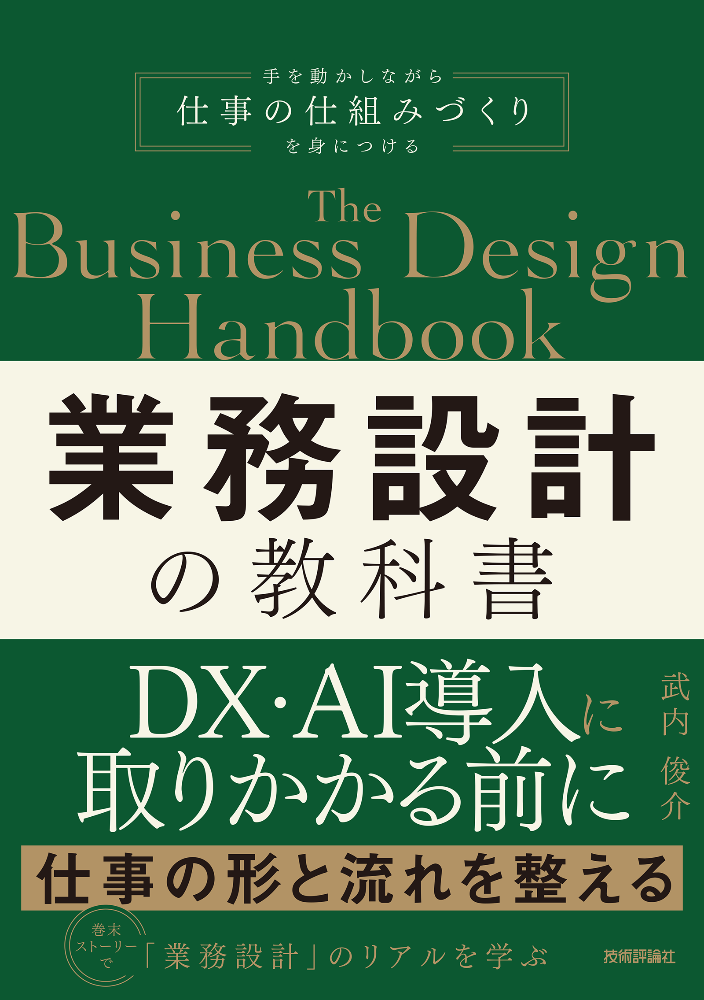
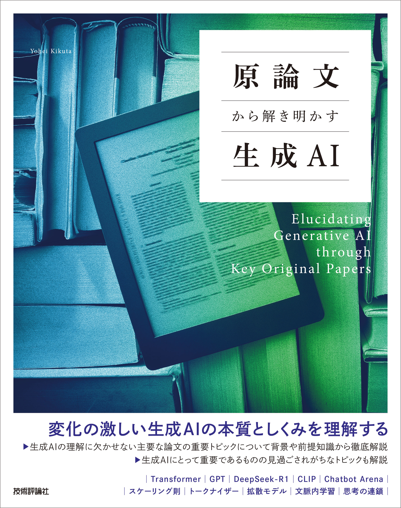
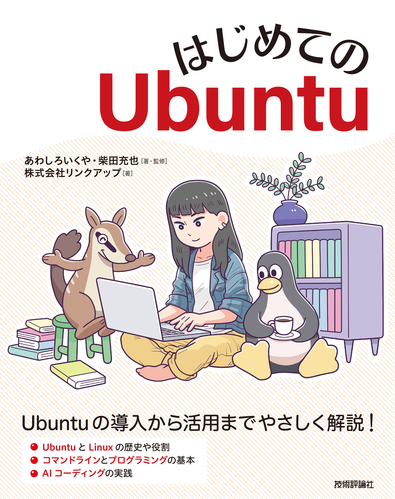
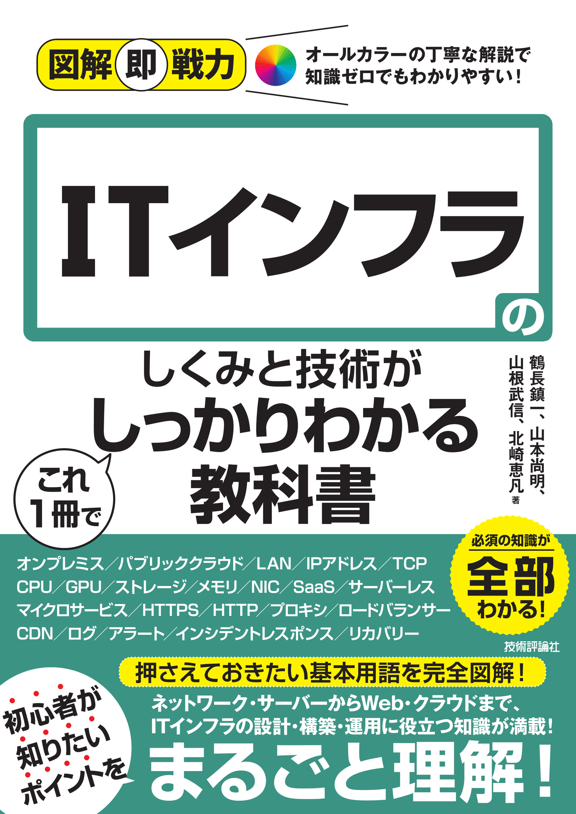

## 編集に携わった書籍 📚

これまでに編集・企画・制作に携わった書籍の一覧です。

---

### 📘 業務設計の教科書

  

**担当**：企画/編集

---

### 📘 原論文から解き明かす生成AI

  

**担当**：企画/編集

---

### 📘 はじめてのUbuntu

  

**担当**：企画/編集

---

### 📘 図解即戦力 ITインフラのしくみと技術がこれ1冊でしっかりわかる教科書

  

**担当**：編集

※ 内容は随時更新予定です
